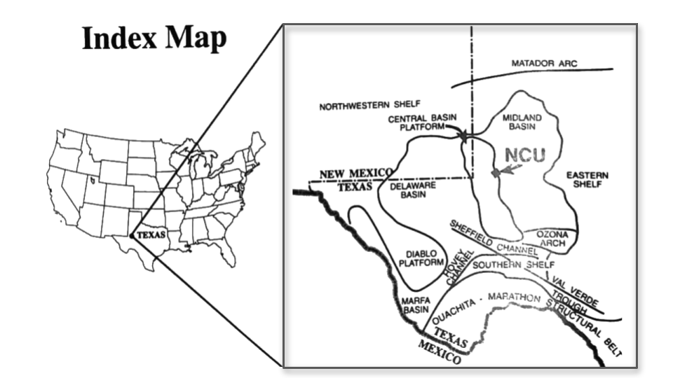

#  Demo Summary

In this demo we present:

1. **An introduction to R and RMarkdown**
2. **The use of a Data Frame and how to create one**
3. **The use of packages and how to initialize them**
4. **The principal data set we will be using in this class**
5. **The use of symbolic objects**
6. **How to get a quick look at your data**
    - Using a correlation plot
7. **How to take the log of a variable**
    - To show a linear relationship with a second (symmetrically distributed) variable in a scatter plot
8. **How to "knit" (produce a document of your code)** 
    - This will enable summarizing your work in a formatted document

# Terminology from this Demo

1.  **R**
    - The programming language we are using
2.  **CRAN**
    - Comprehensive R Archive Network; R's official central software repository
3.  **C.I.**
    - Continuous Integration: A software development strategy for teams to increases development speed and quality
4.  **IDE**
    - Integrated Development Environment
5.  **Chunk**
    - Section of R code
6.  **csv**
    - Comma separated variable
7.  **Data Frame**
    - A data structure that organizes data into a 2-dimensional table of rows and columns
8.  **Tibble**
    - A type of "smart" data frame
9.  **Factors**
    - Categorical data
10. **Global Environment**
    - The interactive workspace environment for objects created during an RMarkdown session

# About R

R is a free programming language that uses open-source software.  It was developed by Ross Ihaka and Robert Gentleman in 1993 and provides access to an extensive global toolbox of contemporary and classical statistical and graphical methods, tests, and analyses, for practical data science applications.  Contributions to the R toolbox, beyond the host of base functions, are through "packages" freely contributed by the global community. The **C**omprehensive **R** **A**rchive **N**etwork, or CRAN, serves as R's official central software repository, and is supported by the R Foundation. Content of the repository includes all current and past version of R, the documentation, and contributed packages that include both source and compiled code. 

## About Continuous Integration Languages
R, like Python, is an **integration language**, referring to the practice of enabling seamless code development and data processing across multiple environments. Both R and Python are also **interpretive languages**, which means they read and execute code line by line, providing immediate feedback during coding. Errors like missing commas, parentheses, or syntax mistakes are flagged in real-time, enabling programmers to correct issues on the fly. This characteristic makes these languages well-designed for both collaborative development settings and individual productivity, allowing coders to rapidly merge and test code changes. Whether used in academic research, commercial software development, or personal projects, R and Python offer flexible and powerful environments for writing, testing, and refining code with exceptional ease and efficiency.

Although there is much more to be said about R and integration languages, a critical characteristic to highlight is their cross-platform scalability. R, Python, and other integration languages are not tied to any single operating system. This makes them particularly valuable when solving "Big Data" problems that require modern computational environments beyond the limitations of traditional operating systems like Windows and macOS. Many current enterprise software solutions, even after being "lifted and shifted" from local desktop environments to centralized or cloud-based, high-performance distributed computers, continue to rely on operating system-specific dependencies. This can limit their ability to fully leverage the computational resources of advanced informatic systems. In contrast, languages such as R and Python are compatible with virtually all common operating systems and are completely scalable for use in the most sophisticated computational environments today, offering unprecedented flexibility and performance across diverse computing landscapes.

Data analysis with R is done in a series of steps; programming, transforming, discovering, modeling and communicating the results.  

**Program**: R is a clear and accessible programming tool
**Transform**: R is made up of a collection of libraries designed specifically for data science
**Discover**: Investigate the data, refine your hypothesis and analyze them
**Model**: R provides a wide array of tools to capture the right model for your data
**Communicate**: Integrate codes, graphs, and outputs to a report with R Markdown or build Shiny apps to share with the world

## Methods for Running R

### Command Line Execution

You can interact with R directly by starting an interactive R session in your terminal. This allows you to type R code line by line, with your computer immediately interpreting and executing each command. However, it's important to note that you must first install R on your computer; simply typing R syntax into a terminal without the R software installed will result in unrecognized commands.

### RStudio

RStudio is an integrated development environment (IDE) for R. It includes a console, syntax-highlighting editor that supports direct code execution, as well as tools for plotting, history, debugging and work space management. RStudio is available in open source and commercial editions and runs on the desktop (Windows, Mac, and Linux) or in a browser connected to RStudio Server or RStudio Workbench (Debian/Ubuntu, Red Hat/CentOS, and SUSE Linux).

In R, each code block is called a "chunk," which is easily identified by opening with {r}``` and closing with  ``` . The following chunk demonstrates reading a data table for our exercise.
The data table, here, originates from an Excel spreadsheet, saved as a .csv (comma-separated values) file—a simple, widely-used file format for data exchange. That said, R can upload data in many different formats.This particular dataset contains samples collected from a West Texas oil field and is named **WT-2D-all-outlier.csv**. As the filename suggests, the data has not yet been "cleaned" or processed to remove outliers, which will be addressed in the subsequent exercise.

A "Data Frame" is a table containing rows and columns, essentially functioning like an Excel spreadsheet as a programmable object within your R script. R provides powerful tools to manipulate these Data Frames in numerous ways. A "tibble" represents a modern, more efficient version of a Data Frame—it does less, but more intelligently and with less computational overhead.

For newer programmers, tibbles are recommended over traditional Data Frames. In the following chunk, we'll import our data input file into a tibble using the read_csv() function. While the default name "df" is generic, it's better to choose a more descriptive name.
Since we're working with a West Texas oil field dataset, more meaningful tibble names could include:

  - "WT_df"
  - "West_Texas"
  - "WestTexas_data"
  - "oil_field_samples"

\text{\underline{The key is to select a name that clearly describes your data's content and origin.}}
The key is to select a name that clearly describes your data’s content and origin. 
Important principles:

- Choose descriptive, meaningful names
- Avoid overly generic identifiers
- Use names that provide immediate context about the data
- Consider using underscores or camel case for readability 

The purpose of the rest of the code in this next chunk is to ensure that certain columns (like sample names and categories) are read as "factors." Factors are simply **categorical variables.**  The tibble tries to recognize the proper format for each variable, but doesn't always get it right!  So, you should check and see.  You can do this after you create the tibble by clicking "**df**" under the **Data** header within the **Global Environment** found in the upper right panel of RStudio. This will open a new tab in your RStudio session displaying the Data Frame. You can take a peek at the data without opening a new tab by hitting the blue "play" symbol button next to the "df" object. 

The code is written to identify the different types of input variables in a generic way.  A prefix is added to each variable type so that it does not matter what the variable name is as long as the data type can be identified.  This can ultimately be useful to make future coding more generic.  In other words, if you were to substitute another .csv file with your own data, you can label your input variables in your original data table with any name of your choosing as long as the proper prefix is attached. 

P_ stands for "**p**property."  

- Most of your measured variables will be properties that use interval or ratio numbers. 
- They could be physical properties, chemical properties, mechanical properties, etc.  
- **C**_ stands for coordinates like X and Y location, UTM's, Lat, Long, etc..  
- L_ stands for "**L**able. Used for categorical properties (factors) like the name of a unit, a layer, a rock     type, soil type, species, region, etc. that you are analyzing.  
- F_ stands for "**F**amily and designates the membership to which samples belong. 
- N_ stands for the sample **N**ame.  Sample names can be alphanumeric or numbers, but latter is generally
    formatted as a factor variable.  

In the data set we will use for this first assessment, the prefixes used are F_, N_, C_, L_, and P_.

The very last part of the code chunk simply prints two different tables, one listing the variables and the other the entire tibble so you can see what it looks like and examine its contents.  It should look exactly like your input data from Excel, for example.  

As you can imagine, this class is not intended to to be a full review of R or Rmarkdown.  With that in mind, you will find comments within the body of each code chunk to help you understand what the code is doing.  Those comments are prefaced by a **#** sign.  That's it for this chunk. After reviewing the sections below, run the script.  I suggest you run each code "chunk" one-at-a-time. That will give you the opportunity to better understand the evolution of the script.    

# Initializing Our Packages:

$\text{\underline{Library Command}}$: The word "library" here acts like a verb. When programming, we will "library" (or call) in the various R-specific packages that we intend to use.

## **Packages and their functions new to this demonstration:**

1. **GGally** 

  - Extends the ggplot2 package and adds functions like a pairwise plot matrix, survival plot, etc.
2. **ggplot2**

  - A declarative graph package that vastly improves upon what is offered by base R. Loaded with tidyverse
3. **kableExtra**

  - Allows one to build complex tables and edit their appearance and style.
4. **knitr** 

  - Provides a general-purpose tool for compiling R Markdown documents into reports.
5. **magrittr**

  - A package (part of tydyverse) that allows one to chain commands using the pipe operator *>%>*. magrittr's         pipes are included within the tidyverse collection of packages. 'While magrittr' is supposed to be             loaded with tidyverse, not all magrittr functions are loaded (divide_by <- `\`).  So, load the magrittr         package separately 
6. **tidyverse**

  - This is a set of packages that all work in harmony to streamline the data science workflow. All of the             packages included within this set include a common design philosophy, grammar, and data structure.
7. **here()**

  - The here() function uses the top-level directory of a project to easily build paths to files.  This is in contrast to the setwd() (set working directory) which is more fragile. 

```{r message = FALSE, warning = FALSE}
library(GGally)
library(kableExtra)
library(knitr)
library(magrittr)
library(tidyverse)
library(here)

here()
```

```{r, eval=FALSE}
setwd("/mnt/vstor/CSE_MSE_RXF131/cradle-members/sdle/jmy41/GIT/jmy-research/topics/RPS_N58")

getwd()
```

# The West Texas Data Set:

Throughout this course, we will use different data sets to demonstrate various principles of data and spatial science. The data sets all have in common an underlying geographic coordinate system from which the sample data are derived. The first data set we will use comes from a West Texas, Permian Basin, Oil Field. The data we will analyze come from electrical and geophysical well logs that record rock properties such as formation structural elevation, formation thickness, the type of rock, porosity, and permeability. While the data set itself comes from the petroleum industry, it serves well to explain the basic process of data ingestion into R and RMarkdown and the introduction to exploratory data analytics.  

## The West Texas Data Set Geology

The following description comes from the Paper entitled, *constraining Geostatistical Reservoir Descriptions with 3-D Seismic Data to Reduce Uncertainty.* The paper is published as chapter 13 in: **Stochastic Modeling and Geostatistics; Principles, Methods, and Case Studies**, edited by J.M. Yarus and R.L. Chambers.  The publication is part of the American Association of Petroleum Geologists (AAPG) Computer Applications in Geology, No. 3.

*" The West Texas unit (WT) is located on the eastern edge of the Central Basin Platform in the West Texas Permian basin. This filed serves as laboratory for many reservoir characterization experiments because it is a vary mature, well characterized reservoir. In the study area, production is from the Guadalupian Grayburg Formation (Permian), which is transitional between the previously more open-marine conditions of the San Andres Formation and the more arid sabkha and silisiclastic eolian dune field environment of the younger Queen Formation.  Lithologically, the Grayburg is composed of alternating dolomite and siltstone for a total thickness of about 140m.  Dolomites range from anhydritic skeletal wackestones though mudstones.  Porosity is moldic or vuggy and can be extensively plugged by anhydrite.  The siltstones are dominantly angular to subrounded quartz grains with angular feldspathic grains, which commonly alter to clay, partially plugging pore throats.  Siltstone porosity is intergranular. This formation has a characteristic shoaling-upward, prograding sedimentary motif, ranging from shallow open-marine to tidal flat/sabkha sediments"*  

The location of the West Texas Project:


NOTE: Within a code chunk, each line beginning with a "**#**" is a comment. Generally, by comments are intended to point out something you may need to know.

```{r message=FALSE, warnings=FALSE}
# This assigns the file location (directory pathway) of the West Texas oil 
# field data to a character variable.
file.name <- "../../data/WT-2D-all-outlier.csv"

# We are creating a tibble called "df" to store our data.

df <- read_csv(file.name)

# Here we are factoring the tibble for all variable names beginning with "N_" 
# and "L_." The %<>% operator is called a "pipe," it is a part of the tidyverse 
# package that we "libraried in" above (go take a look). In this case, it is 
# specifically a # compound assignment pipe that allows us to overwrite our 
# data frame (pointing both directions - called an "assignment pipe"), namely 
# altering the df data frame. Pipes allows us to write large and/or complex
# lines of code. It allows us to chain method calls, or more simply stated, 
# pass the result of a function directly onto another function.

df %<>% # <--note the two-way pipe operator here.
  
# "mutate": a command used to create, modify, or delete columns.  Here the
# the mutate command searches all the column headers looking for any column 
# that starts with an "N_" or an "L". When it finds the columns that matches 
# one of the prefixes, the variable's numerical format is changed to factor.
  
mutate(across(matches("N_|L_"), factor)) 

# The next line of code uses the "head()" command to print the first 15 lines of 
# the Data Frame to the screen. You can comment this line out if you do not
# to print this table.  

head(df, n = 15)
```

This code chunk allows us to see the tibble (data frame) using a different set function, within the package called "**kableExtra**".  The table above lists each variable name in a row followed by its format and the corresponding cell values. If you look at the Global Environment panel in the upper right of your RStudio display, you will see the tibble you created called "df."  If you hover over the "df," you will see that it is referenced as a "**df(tbl_df)**", which stands for, "tibble_Data Frame."  If you click on the little blue arrow symbol next to the tibble name, you can examine its structure which is exactly the same information generated in the code below.  The table that gets printed is not well formatted in the resulting PDF and somewhat difficult to read when it renders after running the code chunk. 


```{r message = FALSE, warnings = FALSE}
kable(head(df, n = 20),
      caption = "The Data Frame") %>%
  kable_styling(
    font_size = 7, 
    full_width = FALSE, 
    latex_options = "scale_down") %>%
  kable_classic(c("striped", "hover"))
```

# Generalizing the script:

This script will read the name of the LAYER you are going to analyze (recall the "L_" prefix), then the location of all the samples (X and Y - recall the prefix, "C_" for coordinate).  Then it will perform an outlier analysis on a variable of choice.  We've selected the variable "P_PHI_pct" for now, but this is where you can modify the code to read any property in your tibble. P_PHI_pct is the variable "porosity percent" in the West Texas data set.

Eventually, when want to use a different .csv file, just copy the entire script to another name (so you can have a second copy that uses a different input data set). Be sure to include your name at the beginning of the script where you see the title block!  This way, **YOU** become the author! 

## Inputs:

This chunk generalizes the key input variable names so that you don't have to type them into a code chunk each time. When you want to enter the coordinates, analyze a different property, or refer to what data are being used for outlier analysis, simply identify those variables here, then run the script.  This will save a lot of time.

```{r message = FALSE, warnings = FALSE}
# Each of these lines of code is creating a symbolic variable in R that holds 
# the name of certain variables you designate.  In this case we are generating 
# symbolic names for each of the coordinates, x and y, and one for the variable  
# we intend to analyze, in this case, porosity.  Obviously, what ever variable 
# you select, must be in a column in your tibble.
xlon <- "C_X_ft"
ylat <- "C_Y_ft"
property <- "P_PHI_pct"
```

### Correlation Plot:

A quick way to get a a look at your data and a sense of the various data relationships is to construct a correlation table. The correlations table performs a pairwise comparison of each variable and generates their respective correlation coefficients and a variety of plots. This way, you can all the data at once and quickly see the relationships amongst them. You should note that the variables plotted here include only the continuous variables along with the factor (categorical) variable, facies.

```{r message = FALSE, warnings = FALSE}
# In this chunk we are creating a second Data Frame called "df2" which is an 
# exact copy of the original data called "df." I tend to do this in coding
# because I would like to have a "clean" original copy of the data frame.  That 
# said, it is not necessary to do this, just a precaution.
df2 <- df %>%  
# This new Data Frame is then piped into the select command. Note, here the 
# the pipe is not an assignment pipe! It is called a "forward pipe operator
# (note, it has only a single "greater-than" symbol). This "selects" only 
# the columns between "L_3_FACIES" and "P_Top_ft," meaning that we do not copy
# the first 4 columns into df2.  You can double check this by comparing df and 
# df2. The "dplyr" followed by 2 colons shows that the "select" function comes 
# from the dplyr package that was "libraried" in. It required here because
# there is another package that uses the term, "select." By using "dplyr::, we
# prevent any confusion as to which function is to be used.  
dplyr::select(L_3_FACIES:P_Top_ft)
```

This correlation plot shows the relationship across each possible binary combination of the 6 selected variables.

```{r message = FALSE, warnings = FALSE, fig.height = 5, fig.width = 8}
# We are using the forward pipe to pass the Data Frame called df2 into a 
# a function called "ggpairs()" that will automatically plot all possible 
# combinations of the variables and their associated correlations (if possible).
# Much of the code here contains a variety of functions and arguments that are
# parameterizing the table that we will shortly print. The 
# color is decided based on the value of the "L_3_FACIES" variable. It is key to 
# note that the variable used to color the charts must be a factor variable.
df2 %>% 
  ggpairs(
    mapping = aes(color = L_3_FACIES),
    upper = list(continuous = wrap("cor", size = 2.5)),
    lower = list(continuous = wrap("smooth", alpha = 0.3, size = 0.6))) +
     theme(axis.text.x = element_text(angle = 45, hjust = 1, size = 7), 
     axis.text.y = element_text(color = "dark blue", size = 6))
```

The correlation chart here uses the categorical variable, L_3_FACIES, to categorize the data into the 3 facies types present.  Facies, you can recall, is the term geologists use for rock types, so in this data frame we have 3 different rock types; 1, 2, and 3. 1 = Carbonate Mud, 2 = Dolomite, and 3 = Siltstone. The correlation chart provides information on the various properties for each rock type.  If you wanted to see the overall property metrics without regard to the rock type, you simply need to modify the code to eliminate the first line under the function, ggpairs() that begins with ... "mapping = aes(color = L_3_FACIES).  Just comment it out (using a # at the beginning of the line).  See the modified code below.

```{r message = FALSE, warnings = FALSE, fig.height = 5, fig.width = 8}
df2 %>% 
  ggpairs(
#    mapping = aes(color = L_3_FACIES),
    upper = list(continuous = wrap("cor", size = 2.5)),
    lower = list(continuous = wrap("smooth", alpha = 0.3, size = 0.6))) +
     theme(axis.text.x = element_text(angle = 45, hjust = 1, size = 7), 
     axis.text.y = element_text(color = "dark blue", size = 6))
```

The image turns to black and white, but you can see the correlation coefficient values are now reflecting the entire sample without regard to the individual rock types. 

You should be able to see which variables are most highly related to each other and which are not. To determine the degree of relationship, take a look at the correlation coefficient at the intersection of the column and row containing the variables you wish to compare.  Higher correlation coefficients (+ or -) is an indication of the strength of the relationship (subject to causality assessment).